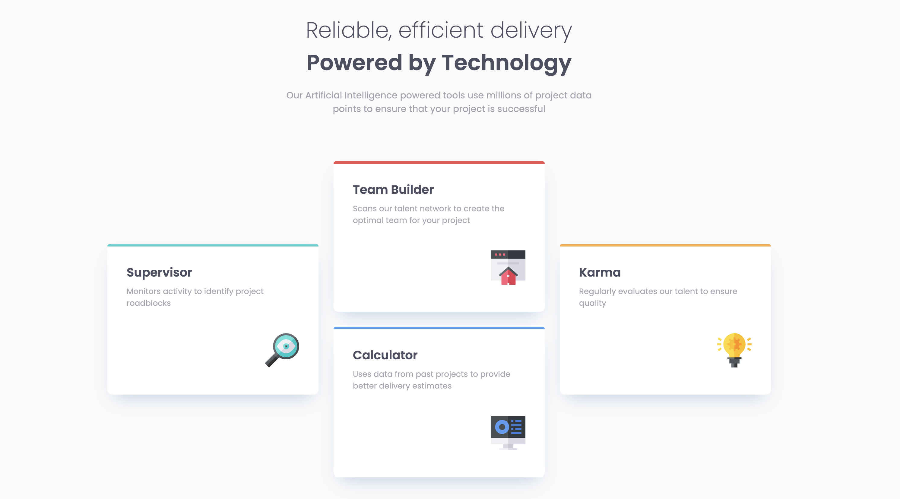
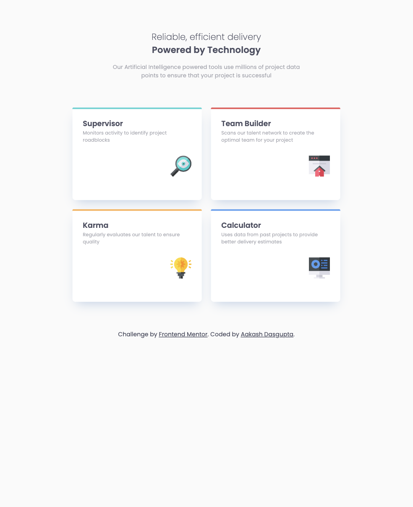
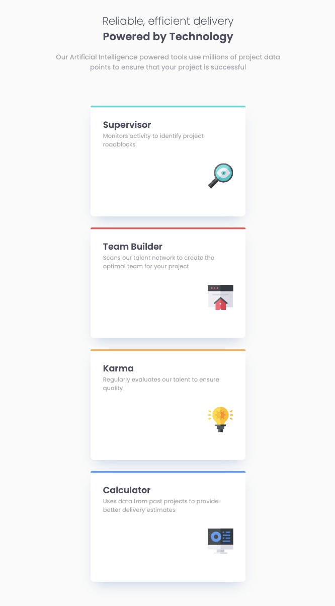

# Frontend Mentor - Four card feature section solution

This is a solution to the [Four card feature section challenge on Frontend Mentor](https://www.frontendmentor.io/challenges/four-card-feature-section-weK1eFYK).

## Table of contents

- [Overview](#overview)
  - [The challenge](#the-challenge)
  - [Screenshot](#screenshot)
  - [Links](#links)
- [My process](#my-process)
  - [Built with](#built-with)
  - [What I learned](#what-i-learned)
  - [Continued development](#continued-development)
  - [Useful resources](#useful-resources)
- [Author](#author)
- [Acknowledgments](#acknowledgments)

## Overview

### The challenge

Users should be able to:

- View the optimal layout for the site depending on their device's screen size

### Screenshot

<!-- <p align="center">
  
  
  
</p>

<p align="center">
  <span style="display: inline-block; width: 30%;">Desktop View</span>
  <span style="display: inline-block; width: 30%;">Tablet View</span>
  <span style="display: inline-block; width: 30%;">Mobile View</span>
</p> -->

<p align="center">
  <figure style="display: inline-block; text-align: center; margin: 10px;">
    
    <figcaption>Desktop View</figcaption>
  </figure>
  <figure style="display: inline-block; text-align: center; margin: 10px;">
    
    <figcaption>Tablet View</figcaption>
  </figure>
  <figure style="display: inline-block; text-align: center; margin: 10px;">
    
    <figcaption>Mobile View</figcaption>
  </figure>
</p>

### Links

- Solution URL: [Link](https://github.com/a-d14/four-card-frontend-mentor)
- Live Site URL: [Link](https://a-d14.github.io/four-card-frontend-mentor)

## My process

### Built with

- Semantic HTML5 markup
- CSS custom properties
- Flexbox
- CSS Grid
- Mobile-first workflow

### What I learned
This project wsa my first rodeo with CSS Grid. It was a new way of thinking that I was not used to. What helped me tremendously in this project was the ```grid-areas``` feature. Helped me keep my CSS shorter and more readable.

### Continued development
I would like to keep working on more CSS Grid projects by building more complex layouts till I understand all the concepts inside and out.

### Useful resources

- [Wes Bos CSS Grid](https://cssgrid.io/) - This is where I learned the concepts of CSS Grid.
- [CSS Tricks](https://css-tricks.com/snippets/css/complete-guide-grid/) - Amazing resource anytime you need a reference while making grids.

## Author
- Frontend Mentor - [@a-d14](https://www.frontendmentor.io/profile/a-d14)

## Acknowledgments
I would like to thank [Darkstar](https://www.frontendmentor.io/profile/DarkstarXDD/solutions) from the wonderful front-end mentor community for helping me with this project. He taught me a neat little trick on how I can create a custom border using the ```::before``` pseudo-element.